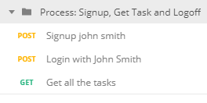

# Task Manager API

> This is a simple project focus on offering a set of CRUD operations in a database of tasks and users with a simple authentication process using dummy email and password and JWT tokens.

---

## Table of Contents

- [Task Manager API](#task-manager-api)
  - [Table of Contents](#table-of-contents)
  - [Technologies](#technologies)
  - [Description](#description)
  - [How To Use](#how-to-use)
    - [Start BE](#start-be)
    - [Test Endpoints using postman](#test-endpoints-using-postman)
  - [References](#references)
- [Author Info](#author-info)

---

## Technologies

* . NET Core
* Authorization process and JWT Tokens (minimalistic)
* [Postman](https://learning.getpostman.com/docs)
* [Fluent Results ](https://github.com/altmann/FluentResults)
* [Fluent Validation](https://fluentvalidation.net)
* [Entity Framework Core](https://docs.microsoft.com/es-es/ef/core/)
* [AutoMapper](https://automapper.org/) 
* [Fluent API](https://docs.microsoft.com/es-es/ef/ef6/modeling/code-first/fluent/types-and-properties) 

---

## Description

The solution have the next three layers structures:

1. **API Layer**: Controllers and filters, responsible of validate requests and tokens using the services or models required.
2. **Services Layer**: Responsible of handle any business logic as login process or task operations. Focus on take logic from the controllers and interact with the repository.
3. **Repository Layer**: Responsible of perform any operation directly with the DB.

Next are the folders and projects:

| C# Project                                                   | Content                                                                                                                                                                                                                                     |
| ------------------------------------------------------------ | ------------------------------------------------------------------------------------------------------------------------------------------------------------------------------------------------------------------------------------------- |
| [TaskManagerAPI](./TaskManagerAPI)                           | **API Layer** Controllers, Filters, Middleware Extensions of .NET Core, error response helpers and Exception handlers.                                                                                                                      |
| [TaskManagerAPI.BL](./TaskManagerAPI.BL)                     | **Service Layer**: Interfaces and its implementations responsible of perform operations using the repository layer.                                                                                                                         |
| [TaskManagerAPI.EF](./TaskManagerAPI.EF)                     | **Entity Framework Project**: Classes that represent the DB connection (not the entity models), migrations, configurations, dummy data and validation using Fluent API.                                                                     |
| [TaskManagerAPI.Models](./TaskManagerAPI.Models)             | **Entity Models Project**: Project to centralize all the objects, request, response and DTOs classes as well as its mappers (using AutoMapper) and its validators (using Fluent Validation).                                                |
| [TaskManagerAPI.Repositories](./TaskManagerAPI.Repositories) | **Repository Layer**: Interfaces and its implementations responsible of performing any action directly to the DB.                                                                                                                           |
| [TaskManagerAPI.Resources](./TaskManagerAPI.Resources)       | **Constants and User Messages Project**: Error codes and its message, constants used along all the other projects and the AppSettings class to model _appsettings.json_, all are located in this project to be referenced in all the other. |
| [TaskManagerAPI.docs](./TaskManagerAPI.docs)                 | **Documentation Folder** to stored all the documentation files.                                                                                                                                                                             |
| [Testing](./Testing)                                         | **Testing Folder** to store files and solutions related to testing. Currently it includes Postman request to test all the CRUD operations of the project                                                                                    |

---

## How To Use

### Start BE

Copy the repository folder, open the _.sln_ file and execute it using the _Debug_ release configuration. By default the project will create an _in-memory_ database with a default set of users and tasks listed in _[DummyDataHelper.cs](API\TaskManagerAPI\TaskManagerAPI.EF\DbInitializer\DummyDataHelper.cs)_ class.

### Test Endpoints using postman

1. Import the postman collection and the environment files
   1. [TaskManager.postman_environment.json](.\Testing\Postman\TaskManager.postman_environment.json)
   2. [TaskManager-Process-Tests.postman_collection.json](.\Testing\Postman\TaskManager-Process-Tests.postman_collection.json)
2. Run any of the the two list of request in the order displayed:

| **Process: Login and perform all task actions available**:                     | **Process: Signup, Get Task and Logoff**                                         |
| ------------------------------------------------------------------------------ | -------------------------------------------------------------------------------- |
|  |  |

Please note the order is required because the first one log in the user and facilitate a jwt token to authenticate in any of the next requests.

3. Test developed in Postman are focus on check the Status code and the content
   1. **Configuration**

    

   2. **Tests Results:**

    

[Back To The Top](#Task-Manager-API)

---

## References

[List of References used](./TaskManagerAPI.docs/References.md)

# Author Info

* Twitter - [@AnguloMascarell](https://twitter.com/angulomascarell)
* LinkedIn - [Carlos Angulo](https://www.linkedin.com/in/angulomascarell)

[Back To The Top](#Task-Manager-API)

